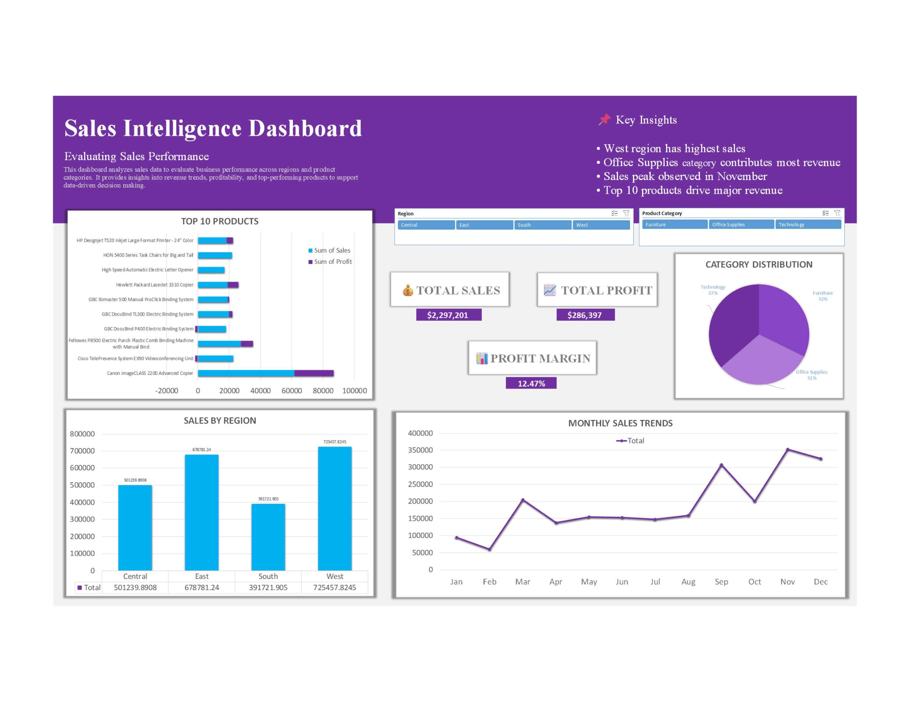

# 📊 Sales Intelligence Dashboard (Excel)

## 📌 Overview

This project presents an interactive **Sales Intelligence Dashboard** built using Microsoft Excel. It analyzes sales performance across regions and product categories to generate actionable business insights and support data-driven decision making.

---

## 🎯 Objectives

* Evaluate overall sales performance
* Identify top-performing products and categories
* Analyze regional sales trends
* Understand profitability and margin patterns

---

## 🚀 Features

* 📊 Interactive dashboard using slicers
* 💰 KPI metrics (Total Sales, Total Profit, Profit Margin)
* 📈 Monthly sales trend analysis
* 🏆 Top 10 products performance
* 🌍 Regional sales comparison
* 🧩 Category distribution visualization

---

## 🛠 Tools & Technologies

* Microsoft Excel
* Power Query (Data Cleaning & Transformation)
* Pivot Tables & Pivot Charts
* Data Model
* Slicers (Interactivity)

---

## 📷 Dashboard Preview

---

## 📈 Key Insights

* West region generates the highest sales
* Office Supplies category contributes the most revenue
* Sales peak observed in November
* Top 10 products drive a significant portion of total revenue

---

## 💼 Business Use Case

This dashboard helps stakeholders monitor sales performance, identify growth opportunities, and make informed strategic decisions based on data insights.

---

## 📂 Project Files

* `Sales_Dashboard.xlsx` → Excel dashboard file
* `dashboard.png` → Dashboard preview image

---

## 🙌 Author

**Kanchan Thakur**
Aspiring Data Analyst

---
